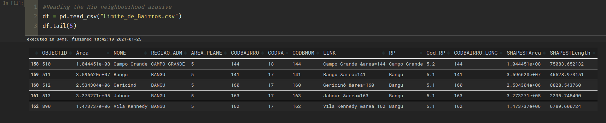
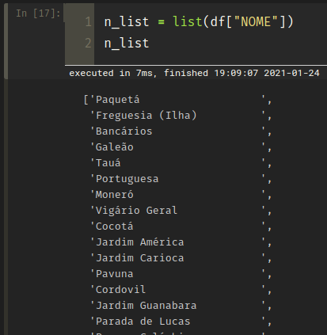
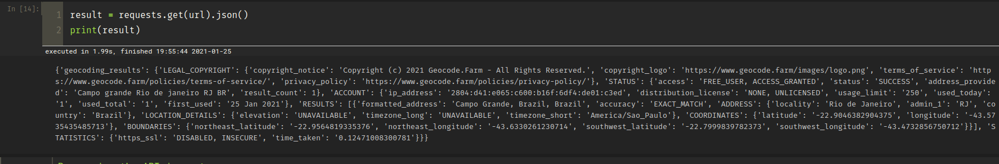
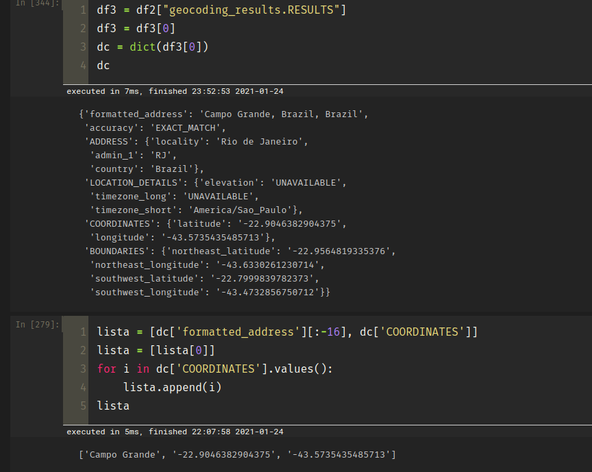

# 
  **IBM Data Science Professional Certificate** 

&nbsp; 

##  
  Capstone - Week 4: Project Assignment - part 2 

&nbsp; 

 
### 
 Project: Steakhouse Filial Neibourhood Research  

&nbsp;

## 
 **Data Sets** 
 
&nbsp;

The main idea is to investigate which neibourhoods has not a big steakhouse and at the same time has a high house income.

Foursquare does not has all the steakhouses in Rio, just the big branded ones, This is not a big problem to the sake of this resarch  as the idea is to serve as reference to the brands that already has many filials, and in this case small local restaurants does not offer the same experience and appeal.

I will use two data sets and two APIs for this project:

* https://www.data.rio

This is the source of neighbourhood list and geometry. 

I saved in the csv file and selected just the names data.

* https://pt.wikipedia.org/wiki/Lista_de_bairros_do_Rio_de_Janeiro_por_IDH

The source of the family income by neighbourhood

* https://www.geocode.farm

This is for the latitude and longitude.

What, after filtering, remain just the coordenates:

And, Foursquare for the venues discover, as required.

Now, I must to code the loop to iterate a requisition to each neighbourhood, other to automatize the process of filtering the data.

Finally, will submit the data to clustering and from the result select the region of higher income.

This became be the recomendation for the stakehouse new filial.
